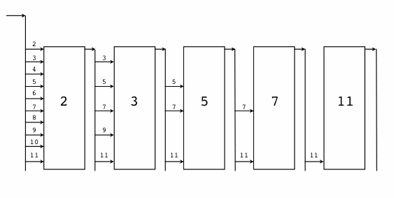

Въведение в програмния език Go
##############################

Предговор
=========

Този документ е урок, представящ основите на програмния език Go, предвиден за програмисти, запознати с C или C++. 
Това не е подробен наръчник за езика; до този момент най-близкия документ до това е `спецификацията на езика <http://weekly.golang.org/doc/go_spec.html>`_. 
След като прочетете този урок, можете да продължите с `Ефективен Go <http://weekly.golang.org/doc/effective_go.html>`_, който навлиза по-дълбоко в 
това как се използва езика и говори за стил и идиоми при програмирането с Go. Съществува и интерактивна интродукция в Go, наречена `Разходка в Go <http://tour.golang.org/>`_.

Презентацията тук преминава през серия от най-скромни програми, за да илюстрира основните особености на езика. Всички програми
работят (в момента на писане) и са качени в хранилището в директория `/doc/progs/ <http://weekly.golang.org/doc/progs>`_.

Здравей свят
============

Нека започнем по обичайния начин:

.. code-block:: go

    package main

    mport fmt "fmt" // Пакет имплементиращ форматиран I/O.

    func main() {
        fmt.Printf("Здравей свят!; или Καλημέρα κόσμε; или こんにちは 世界\n")
    }

Всеки файл с изходен код в Go, използвайки ``package`` изявлението, което показва към кой пакет принадлежи. Също така може да вмъква други пакети, за да 
използва техните удобства. Тази програма вмъква пакета ``fmt``, за да добие достъп до нашия стар, сега с главна буква и пакетиран приятел, ``fmt.Printf``.

Функциите се представят с ключовата дума ``func``. Функцията ``main`` в пакета ``main`` е мястото, където програмата се изпълнява (след всяко стартиране).

Низови константи могат да съдържат уникод символи, кодирани в UTF-8. (Всъщност, изходните файлове на Go по дефиниця са кодирани в UTF-8)

Конвенцията за писането на кометари е същата като при C++.

По-късно ще споменем повече относно принтирането.

Точки и запетаи
===============

Може би сте забелязали, че в нашата програма няма точки и запетаи. В Go кода, единственото място в което вероятно ще използвате точки и запетаи е при
разграничаването на клаузите във ``for`` цикъл и подобни; не са необходими след всяка заявка.

Всъщност това, което се случва е, че формалният език използва точки и запетаи, както в C или Java, но те се добавят автоматично в края на всеки ред, който
изглежда като край на заявка. Не е необходимо да ги въвеждате.

За подробности как е направено това, можете да погледнете спецификацията на езика, но за практиката всичко, което трябва да знаете е, че никога няма да потребява
да слагате точки и запетаи в края на ред. (Можете да ги поставяте ако искате да напишете няколко заявки на един ред). Като допълнителна помощ можете да
поставяте точка и запетая веднага преди затварянето на скоба.

Този подход спомага за код, който няма точки и запетаи и изглежда добре. Единствената изненада е, че е важно да поставяте отварящата къдрава скоба на конструктор
като ``if`` на същия ред, на който е ``if``; ако не направите това, съществуват ситуации, в които кода няма да се компилира или ще даде грешен резултат. Езикът
налага този стил на къдрави скови до известна степен.

Компилиране
===========

Go е компилируем език. В момента същствуват два компилатора: ``Gccgo`` е Go компилатор, който използва за основа GCC. Има и пакет от компилатори с различни (и странни)
имена за всяка архитектура: ``6g`` за 64-bit x86, 8g за 32-bit x86 и други. Тези компилатори работят значително по-бързо, но генерират по-малко ефикасен код, в
сравнение с ``gccgo``. В момента на писане (края на 2009), те имат и по-стабилна run-time система, въпреки, че gccgo наваксва.

Ето как да компилираме и изпълним нашата програма. С 6g, казваме:

.. code-block:: console

    $ 6g helloworld.go  # компилира; обекта отива в helloworld.6
    $ 6l helloworld.6   # линкер; изходът отива в 6.out
    $ ./6.out
    Здравей свят!; или Καλημέρα κόσμε; или こんにちは 世界
    $

С ``gccgo`` това изглежда малко по-традиционно:

.. code-block:: console

    $ gccgo helloworld.go
    $ ./a.out
    Здравей свят!; или Καλημέρα κόσμε; или こんにちは 世界
    $

Echo
====

Подред, това е версия на Unix инструмента ``echo(1)``:

.. code-block:: go

    package main

    import (
        "flag" // четец за опции в командния ред
        "os"
    )

    var omitNewline = flag.Bool("n", false, "не разпечатвай последния нов ред")

    const (
        Space   = " "
        Newline = "\n"
    )

    func main() {
        flag.Parse() // Сканира списъка с аргументи и задава флагове
        var s string = ""
        for i := 0; i < flag.NArg(); i++ {
            if i > 0 {
                s += Space
            }
            s += flag.Arg(i)
        }
        if !*omitNewline {
            s += Newline
        }
        os.Stdout.WriteString(s)
    }

Тази програма е малка, но прави много нови неща. В последния пример видяхме, че ``func`` представя функция. 
Ключовите думи ``var``, ``const`` и ``type`` (не е използвана още) също представляват декларации, както и import.
Забележете, че можем да групираме декларации от еднакъв тип в списъци, един елемент на ред, както ``import`` и 
``const`` клаузите тук. Но не е задължително да се прави; бихме могли да кажем

.. code-block:: go

    const Space = " "
    const Newline = "\n"

Тази програма вмъква "os" пакета, за да има достъп до неговата ``Stdout`` променливата, от тип  ``*os.File``.
Заявката ``import`` е всъщност декларация: в своята основна форма, както е използвана в нашата "здравей свят" програма.
Именува идентификатора (``fmt``), който ще бъде използван за достъп до членовете на пакета вмъкнат от (``"fmt"``)
файла, който може да бъде намерен в настоящата директория или в стандартната локация. В тази програма, обаче, ние
изпускаме изричното име от вмъкването; по подразбиране пакетите се вмъкват, използвайки име дефинирано от вмъквания
пакет, което по условие е самото име на файла. Нашата "здравей свят" програма, можеше просто да казва 
``import "fmt"``.

Можете да определяте собствени имена за вмъквания ако поискате, но това е необходимо само ако искате да избегнете
конфликт с именуване.

Имайки ``os.Stdout``, можем да използваме неговия ``WriteString`` метод, за да принтираме низа.

След като вмъкнем ``flag`` пакета, можем да използваме ``var`` декларацията, за да инициализираме глобална променлива,
наречена ``omitNewline``, която да съдържа стойността на ``-n`` флага на echo. Променливата е от тип ``*bool``, 
показател към ``bool``.

В ``main.main`` правим разбор на аргументите (извикването на ``flag.Parse``) и след това създаваме локална низова
променлива, с която да създадем изхода.

Декларационната заявка има формата

.. code-block:: go
    
    var s string = ""

Това е ключовата дума ``var``, последвана от името на променливата, последвана от нейния тип, последван от знакът
равно и първоначалната стойност на променливата.

Go се опитва да бъде сбит и тази декларация може да бъде съкратена. Тъй като низовата константа е от тип низ, не е
необходимо да казваме това на компилатора. Можем да напишем:

.. code-block:: go

    var s = ""

Дори можем да бъдем още по-кратки, използвайки идиома

.. code-block:: go

    s := ""

Операторът ``:=`` се използва много често в Go, за да представи инициализираща декларация. Има такъв в следващия
ред във ``for`` клаузата:

.. code-block:: go

    for i := 0; i < flag.NArg(); i++ {

Пакетът ``flag`` е направил разбор на аргументите и е поставил не-flag аргументите в списък, който може да бъде
обходем по очевидия начин.

Заявката ``for`` в Go се различава от тази в C по много причини. Първо, това е единствения цикъл, няма ``while`` или
``do``. Второ, няма скоби в клаузата, но къдравите скоби в тялото са задължителни. Същото важи и за ``if`` и 
``switch`` заявките. По-късни примери ще покажат други начини как може да бъде написан ``for`` цикъл.

Тялото на цикъла попълва низът ``s``, добавяйки (използвайки ``+=``) аргументите и отделящите шпации. След цикъла, ако
``-n`` флагът липсва, програмата добавя нов ред. Накрая изписва резултата.

Забележете, че ``main.main`` е функция без аргументи. Дефинирана е по този начин. Стигайки краят на ``main.main``
означава "успех"; ако искате да сигнализирате грешен изход можете да извикате

.. code-block:: go

    os.Exit(1)

Пакетът ``os`` съдържа и други съществени елементи; на пример, ``os.Args`` е част, използвана от ``flag`` пакета за
достъп до аргументите в командния ред.

Антракт относно типове
======================

Go има някои познати типове като ``int`` и ``uint`` (unsigned int), които представляват стойности от "посходящ" размер
за машината. Също така дефинира и изрично-ограничени типове като ``int8``, ``float64`` и т.н., плюс неподписани типове
като ``uint``, ``uint32`` и други. Това са различни типове, дори ако ``int`` и ``int32`` са с размер от 32 бита, те
са различни типове. Същестува и ``byte`` синоним за ``uint8``, който е тип елемент за низове.

Типове с плаваща запетая са винаги оразмерени: ``float32`` и ``float64``, плюс ``complex64`` (два ``float32``) и 
``complex128`` (два ``float64``). Комплексните числа са извън предмета на урока.

Говорейки за ``string``, това също е вграден тип. Низовете са *неизменими променливи* - те не са просто масиви от
``byte`` стойности. След като веднъж сте построили низова *стойност*, можете да я промените, въпреки че, разбира се, 
можете да промените низова *променлива* като просто я превъзложите. Изрезката код от ``strings.go`` е легален код:

.. code-block:: go

    s := "hello"
    if s[1] != 'e' {
        os.Exit(1)
    }
    s = "good bye"
    var p *string = &s
    *p = "ciao"

Обаче следните заявки са нелегални, защото ще променят ``string`` стойността:

.. code-block:: go

    s[0] = 'x'
    (*p)[1] = 'y'

Според C++ определението, низовете в Go са като ``const strings``, докато показателите към низовете са аналогични на
референции към ``const string``.

Да има показатели. Въпреки това Go опростява тяхното използване; прочетете нататък.

Масивите се декларират така:

.. code-block:: go

    var arrayOfInt [10]int

Масивите, както низовете, са стойности, но те са непостоянни. Това се различава от C, където arrayOfInt ще бъде 
използван като показател към ``int``. В Go, тъй като масивите са стойности, е смислено (и полезно) да се говори
за показатели към масиви.

Размерът на масива е част от неговия тип; въпреки това е допустимо да се декларира *изрязана* променлива, която да 
съдържа референция към който и да е масив, от всякакъв размер, със същия тип елементи. *Изрязващ израз* има
формата ``a[low : high]``, представляващ вътрешен масив, индексиран от ``low`` до ``high-1``; крайната изрезка 
е индексирана от 0 до ``high-low-1``. На кратко, изрезките приличат на масиви, но нямат изричен размер(``[]`` срещу
``[10]``) и те представят сегмент от подстоящия, обикновено анонимен, нормален масив. многобройи изрезки могат
да споделят данни ако представляват един и същи масив; многобройни масиви не могат никога да споделят данни.

Изрезките са по-често срещани в Go, отколкото нормални масиви; те са по-гъвкави, имат семантични връзки и са 
ефективни. Това което им липсва е прецизния контрол на макет за записване както при обикновените масиви; ако
искате да имате стотина елемента от масив записвани във вашата структура, трябва да използвате нормален масив.
За да създадете такъв, използвайте *конструктор* на съединителна стойност - израз формиран от типа, следван от израз
ограден в къдрави скоби както в следния пример:

.. code-block:: go

    [3]int{1,2,3}

В този случай конструктора създава масив от 3 цифри (``int``).

Когато подавате масив към функция, почти винаги ще искате да декларирате формалния параметър като изрезка. Когато
извикате функцията, изрежете масива, за да създадете (ефикасна) свързана изрезка и подайте нея. По подразбиране
горния и долния край на изрезка отговарят на краищата на съществуващия обект, така сбитата нотация ``[:]`` ще
изреже целия масив:

.. code-block:: go

    func sum(a []int) int { // връща число
        s := 0
        for i := 0; i < len(a); i++ {
            s += a[i]
        }
        return s
    }

Забележете как типът (int) на връщаната стойност бива дефиниран за ``sum``, заявявайки го след списъка с параметри.

За да извикаме функцията, изрязваме масива. Този код (ще покажем по-просто начин след малко) създава масив и го 
изрязва:

.. code-block:: go

    x := [3]int{1,2,3}
    s := sum(x[:])

Ако създавате обикновен масив, но искате компилатора да преброи елементите за вас, използвайте ``...`` като размер
на масива.

.. code-block:: go

    x := [...]int{1,2,3}
    s := sum(x[:])

Но това е по-объркано от необходимото. В практиката, освен ако не сте педантични относно начина на записване в
структурата от данни, изрезката сама - използвайки празни скоби без размер - е всичко, от което се нуждаете:

.. code-block:: go

    s := sum([]int{1,2,3})

Съществуват също така и карти, които могат да бъдат инициализирани така:

.. code-block:: go

    m := map[string]int{"one":1, "two":2}

Вградената функция ``len``, която връща броят елементи, се появява за първи път в ``sum``. Работи над низове, масиви,
изрезки, карти и канали.

Между другото друго нещо, което работи над низове, масиви, изрезки, карти и канали е ``range`` клаузата в ``for``
цикли. Вместо да пишете

.. code-block:: go

    for i := 0; i < len(a); i++ { ... }

за да обходите елементите на изрезка (или карта, или ...) можете да напишете:

.. code-block:: go

    for i, v := range(a) { ... }

Това задава ``i`` към индексът и ``v`` към стойността на следващите елемнти от целта на обхвата. 
Виж :doc:`effective_go` за повече примери.

Антракт относно алокация
========================

Повечето типове в Go са стойности. Ако имате ``int`` или ``struct`` или някакъв масив, предаването копира съдържанието
на обекта. За да разпределите нова променлива, използвайте вградената функция ``new``, която връща показател
към разпределеното хранилище.

.. code-block:: go

    type T struct { a, b int}
    var t \*T = new(T)

или по-идиоматичното

.. code-block:: go

    t := new(T)

Някои типове - карти, изрезки и канали (виж по-долу) - имат свързана семантика. Ако държите изрезка или карта и искате
да промените тяхното съдържание, други променливи, които референсират същите данни ще видят промяната. За тези три
типа искате да използвате вградената функция, ``make``:

.. code-block:: go

    m := make(map[string]int)

Тази заявка инициализира нова карта, готова да съдържа елементи. Ако просто декларирате картата, какво в

.. code-block:: go

    var m map[string]int

това ще създаде ``nil`` референция, която не може да съдържа нищо. За да използвате картата, първо трябва да инициализирате
връзката, използвайки ``make`` или като зададате вече съществуваща карта.

Забележете, че ``new(T)`` връща тип ``*T``, докато ``make(T)`` връща тип ``T``. Ако (по погрешка) разпределите свързан
обект с ``new`` вместо ``make``, ще получите показател към ``nil`` връзка, еквивалентно на това да декларирате
неинициализирана променлива и да вземете нейния адрес.

Антракт към константи
=====================

Въпреки че числовите типове идват с много размери в Go, това не се отнася за числовите константи. Няма константи
като ``0LL`` или ``0x0LL``. Вместо това числовите константи биват еволюирани като много-прецизни стойности, които
могат да прелеят само, когато са зададени към числова променлива с твърде малка прецизност, за да представят
стойността.

.. code-block:: go

    const hardEight = (1 << 100) >> 97 // логално

Има нюанси, които заслужават пренасочване към терминологията на езиковата спецификация, но тук има няколко примера
за илюстрация

.. code-block:: go

    var a uint64 = 0  // има тип uint64, стоност 0
    a := uint64(0)    // еквивалент; използва "конвертиране"
    i := 0x1234       // i получава тип по подразбиране: int
    var j int = 1e6   // легално - 1000000 бира репрезентирано в int
    x := 1.5          // float64, типа по подразбиране за константи с плаваща запетая
    i3div2 := 3/2     // числово делене - резултата е 1
    f3div2 := 3./2.   // деление с плаваща запетая - резултата е 1.5

Конвертиранията работят само за просто случаи като конвертиране на на ``int`` с един знак или размер в друг и между
прости числа и числа с плаваща запетая, плюс няколко други инстанции извън обхвана на урока. Не съществуват никакви
автоматични числови конвертирания в Go, освен че направените константи имат конкретен размер и тип когато биват
зададени към променлива.

I/O Пакет
=========

Следва да погледнем прост пакет за създаване на подобен на Unix файлов I/O с орваряне/затваряне/четене/писане интерфейс.
Ето началото на ``file.go``:

.. code-block:: go

    package file

    import (
        "os"
        "syscall"
    )

    type File struct {
        fd   int    // file descriptor number
        name string // име на файла по време на Отваряне        
    }

Първите няколко реда декларират иметона пакета - ``fie`` - и след това вмъкват два пакета. Пакетът ``os`` крие различия
между различни операционни системи, за да даде консистентен изглед на файлове и т.н.; Тук ние ще използваме неговите
инструменти за боравене с грешки и за да пресъздадем основите на неговия файлов I/O.

Другият елемент е външен пакет syscall от ниско ниво, който представя примитивен интерфейс към основните обаждания към
операционната система. Пекетът ``syscall`` е много зависим от системата и начинът, по който е използван тук
работи само на Unix-подобни операционни системи, но основните идеи разгледани тук са широко-приложими. (Windows 
версия може да бъде намерен на `file_windows.go <http://weekly.golang.org/doc/progs/file_windows.go>`_)

Следва дефиниция на тип: ключовата дума ``type`` представя деклариране на тип, в този случай структура от данни, 
наречена ``File``. За да направим нещата малко по-интересни, нашият ``File`` включва името на файла, към който
описателят на файла, към който сочи описателят на файла.

Защото ``File`` започва с главна буква, типът е достъпен извън пакета, в който е, за използващите този пакет. В Go
правилото относно видимостта на информацията е просто: ако име (на тип от горно ниво, функция, метод, константа или
променлива, или на структурно поле или метод) започва с главна буква, потребителите на пакета могат да го видят. В 
противен случай, името и следователно нещото, което репрезентира е видимо само в пакета, в който е дефинирано.
Това е повече конвенция; правилото бива прилагано от компилатора. В Go, терминът за публично видими имена е
"изнесен".

В този случая на ``File``, всички негови полета са с малки букви и не са видими за потребителите, но ние скоро ще му
дадем някои изнесени метода с главна буква.

Първо обаче това е фабриката за създаване на файл:

.. code-block:: go

    func newFile(fd int, name string) *File {
        if fd < 0 {
            return nil
        }
        return &File{fd, name}
    }

**
Това връща показател към нова ``File`` структура с попълнени описание на файла и име. Този код използва нотация на Go
за "композиционен литерал", аналогично на тези, използвани за създаване на карти и масиви, за конструиране на нов
heap-алокализиран обект. Бихме могли да напишем:

.. code-block:: go

    n := new(File)
    n.fd = fd
    n.name = name
    return n

но за прости структури като ``File`` е по-лесно да върнем адреса на композирания литерал, както е направено тук във
връщащата заявката от ``newFile``.

Можем да използваме фабриката за да конструираме някои подобни, изнесени променливи от тип ``*File``:

.. code-block:: go

    var (
        Stdin  = newFile(syscall.Stdin, "/dev/stdin")
        Stdout = newFile(syscall.Stdout, "/dev/stdout")
        Stderr = newFile(syscall.Stderr, "/dev/stderr")
    )

Функцията ``newFile`` не е изнесена, защото е вътрешна. Правилната, изнесена фабрика за използване е ``OpenFile`` 
(ще обясним това след малко):

.. code-block:: go

    func OpenFile(name string, mode int, perm uint32) (file *File, err error) {
        r, err := syscall.Open(name, mode, perm)
        return newFile(r, name), err
    }

**
Има голям брой неща в тези редове. Първо, ``OpenFile`` връща повече стойности, ``File`` и грешка (повече за грешите
след малко). Деклрарираме много-стойностно връщане като списък с декларации, ограден в скоби; синтактично изглеждат
като втори списък с параметри. Функцията ``syscall.Open`` също има много-стойностно връщане, което можем да хванем
с много-променлива декларация на първия ред; деклрарира ``r`` и ``err``, които ще съдръжат двете стойности, и двете от
тип ``int`` (макар, че за това трябва да погледнете изходния код на ``syscall`` пакета, за да го разберете). Накрая
``OpenFile`` връща две стойности: показател към нов ``File`` и грешка. Ако ``syscall.Open`` се провали, описателят на
файла ``r`` ще бъде негативен и ``newFile`` ще върне ``nil``.

Относно тези грешки: Go езикът включва основна нотация на грешка: предефиниран тип ``error`` със свойства (описани
по-долу), който представя добра база за презентиране и обработване на грешки. Добра идея е да използвате неговата 
фабрика във вашите собствени интерфейси, както правим тук, за съвместимо обработване на грешки чрез Go код. В
``OpenFile`` използваме конвертиране, за да преведем числовата стойност на ``errno`` в Unix в числов тип ``оs.Errno``,
което е имплементация на ``error``.

Защо ``OpenFile``, а не ``Open``? За да имитираме ``os`` пакета на Go, който нашето упражнение емулира. Пакетът ``os``
използва възможността най-честите случаи - отваряне за четене и създаване за писане - най-лесни, просто ``Open`` и 
``Create``. ``OpenFile`` е основния случай, аналогичен на системното обаждане в Unix - ``Open``. Тук е имплементацията
на нашите ``Open`` и ``Create``, те са тривиални обвивки, които елиминират честите грешки, като хващат подвещащите
стандартни аргументи за отваряне и, осоебено, за създаване на файл:

.. code-block:: go

    const (
        O_RDONLY = syscall.O_RDONLY
        O_RDWR = syscall.O_RDWR
        O_CREATE = syscall.O_CREAT
        O_TRUNC = syscall.O_TRUNC
    )

    func Open(name string) (file *File, err error) {
        return OpenFile(name, O_RDONLY, 0)
    }

.. code-block:: go

    func Create(name string) (file *File, err error) {
        return OpenFile(name, O_RDWR|O_CREATE|O_TRUNC, 0666)
    }

**
Обратно към нашата история. Сега след като можем да създаваме ``Files``, можем да запишем методи към тях. За да 
декларираме метод към тип, дефинираме функция, която да има изричен приемник от този тип, позициониран в скоби
преди името на функцията. Ето някои методи за ``*File``, всеки от които декларира приемна променлива ``file``:

.. code-block:: go

    func (file *File) Close() error {
        if file == nil {
            return os.ErrInvalid
        }
        err := syscall.Close(file.fd)
        file.fd = -1 // така не може да бъде затворен отново
        return err
    }

    func (file *File) Read(b []byte) (ret int, err error) {
        if file == nil {
            return -1, os.ErrInvalid
        }
        r, err := syscall.Read(file.fd, b)
        return int(r), err
    }

    func (file *File) Write(b []byte) (ret int, err error) {
        if file == nil {
            return -1, os.ErrInvalid
        }
        r, err := syscall.Write(file.fd, b)
        return int(r), err
    }

    func (file *File) String() string {
        return file.name
    }

**
Не съществува косвен ``this`` и приемната променлива трябва да бъде използвана за достъп до членовете на структурата.
Методи не се декларират в самата ``struct`` декларация. Декларацията ``struct`` дефинира само членове на данните.
Всъщност методи могат да бъдат създавани за почти всеки тип, за който се сетите, като числа или масиви, не само за
``structs``. Ще видим пример с масиви по-късно.

Методът ``String`` е наречен така, заради конвенция за принтиране, която ще опишем по-късно.

Методите използват публичната променлива ``os.ErrInvalid`` за да върнат (``error`` версията на) Unix код за грешка
``EINVAL``. Библиотеката ``os`` дефинира стандарт комплект от подобни стойности за грешка.

Сега вече можем да използваме нашия нов пакет:

.. code-block:: go

    package main

    import (
        "./file"
        "fmt"
        "os"
    )

    func main() {
        hello := []byte("hello world\n")
        file.Stdout.Write(hello)
        f, err := file.Open("/does/not/exists)
        if f == nil {
            fmt.Printf("Файлът не може да бъде отворен: err=%s\n", err.Error())
            os.Exit(1)
        }
    }

**

.. note::
    При "./" във вмъкването на ``"./file"`` казваме на компилатора да използва нашия пакет, вместо нещо от 
    директорията с инсталирани пакети. (Също, ``"file.go"`` трябва да бъде компилиран преди да вмъкнем пакета.)

Вече можем да компилираме и изпълним програмата. Под Unix резултатът би бил такъв:

.. code-block:: console

    $ 6g file.go                       # компилиране на file пакета
    $ 6g helloworld3.go                # компилиране на main пакета
    $ 6l -o helloworld3 helloworld3.6  # свързване - не е нобходимо да се споменава "file"
    $ ./helloworld3
    hello, world
    Файлът не може да бъде отворен: err=No such file or directory
    $

Гниещи котки
============

Строейки върху ``file`` пакета, следващото е опростена версия на Unix инструмента ``cat(1)``, ``progs/cat.go``

.. code-block:: go

    package main

    import (
        "./file"
        "flag"
        "fmt"
        "os"
    )

    func cat(f *file.File) {
        const NBUF = 512
        var buf [NBUF]byte
        for {
            switch nr, er := f.Read(buf[:]); true {
            case nr < 0:
                fmt.Fprintf(os.Stderr, "cat: error reading from %s: %s\n", f, er)
                os.Exit(1)
            case nr == 0: // EOF
                return
            case nr > 0:
                if nw, ew := file.Stdout.Write(buf[0:nr]); nw != nr {
                    fmt.Fprintf(os.Stderr, "cat: error writing from %s: %s\n", f, ew)
                    os.Exit(1)
                }
            }
        }
    }

    func main() {
        flag.Parse() // Scans the arg list and sets up flags
        if flag.NArg() == 0 {
            cat(file.Stdin)
        }
        for i := 0; i < flag.NArg(); i++ {
            f, err := file.Open(flag.Arg(i))
            if f == nil {
                fmt.Fprintf(os.Stderr, "cat: can't open %s: error %s\n", flag.Arg(i), err)
                os.Exit(1)
            }
            cat(f)
            f.Close()
        }
    }

**
До този момент това би трябвало да бъде лесно за проследяване, но ``switch`` заявката представя някои нови свойства.
Както ``for`` и ``if``, ``switch`` може да включва инициализираща заявка. Заявката ``switch`` в ``cat`` използва
такава за създаване на променливите ``nr`` и ``er``, които да съдържат върнатите стойности от извикването на
``f.Read`` (``if`` няколко реда по-късно има същата идея.) Заявката ``switch`` е основна: оценява случаите от
началото до края, търсейки за първия случай отговарящ на стойността; изразите за случай (``case``) не е задължително
да бъдат константи или дори числа, докато всички имат един и същи тип.

Тъй като ``switch`` стойността е просто ``true``, можем да я избегнем - както е в случая на ``for`` заявката,
липсваща стойност означава ``true``. Всъщност ``switch`` е форма на ``if-else`` верига. Докато сме тук, трябва да бъде
споменато, че в ``switch`` заявки всеки ``case`` има косвен/скрит ``break``.

Аргументът към ``file.Stdout.Write`` е създаден от изрязване на масива ``buf``. Изрезките представляват стандартния
Go-начин за работа с I/O буфери.

Сега нека направим вариант на ``cat``, който опционално прави ``rot13`` на своя изход. Лесно е да се направи като
просто се обработят байтовете, но вместо това ние ще използваме нотацията на Go за *интерфейс*.

Субротината на ``cat`` използва само два метода на ``f.Read`` и ``String``, така че нека започнем като дефинираме
интерфейс, който има точно тези два метода. Ето кода от ``progs/cat_rot13.go``:

.. code-block:: go

    type reader interface {
        Read(b []byte) (ret int, err error)
        string() string
    }

Всеки тип, който има два метода от ``reader`` - без значение от това колко още други метода има типът - е казано да
*имплементира* инферфейса. След като ``file.File`` имплементира тези методи, той имплементира ``reader`` интерфейс.
Можем да променим ``cat`` субротината да приема ``reader`` вместо ``*file.File`` и ще работи просто добре, но нека
разкрасим преди това като напишем втори тип, който имплементира ``reader``, такъв който обвива съществуващ ``reader``
и изпълнява ``rot13`` върху данните. За да направим това просто дефинираме тип и имплементираме методите и без 
повече осчетоводяване имаме втора имплементация на ``reader`` интерфейс.

.. code-block:: go

    type rotate13 struct {
        source reader
    }

    func newRotate13(source reader) *rotate13 {
        return &rotate13{source}
    }

    func (r13 *rotate13) Read(b []byte) (ret int, err error) {
        r, e := r13.source.Read(b)
        for i := 0; i < r; i++ {
            b[i] = rot13(b[i])
        }
        return r, e
    }

    func (r13 *rotate13) String() string {
        return r13.source.String()
    }

**

.. note:: Функцията ``rot13`` извикана в ``Read`` е тривиална и не е нужно да бъде пресъздавана тук

За да използваме новата функционалност дефинираме флаг:

.. code-block:: go
    
    var rot13Flag = glag.Bool("rot13", false, "rot13 the input")

и го използваме от почти непроменената ``cat`` функция:

.. code-block:: go

    func cat(r reader) {
        const NBUF = 512
        var buf [NBUF]byte

        if *rot13Flag {
            r = newRotate13(r)
        }
        for {
            switch nr, er := r.Read(buf[:]); {
            case nr < 0:
                fmt.Fprintf(os.Stderr, "cat: error reading from %s: %s\n", r, er)
                os.Exit(1)
            case nr == 0: // EOF
                return
            case nr > 0:
                nw, ew := file.Stdout.Write(buf[0:nr])
                if nw != nr {
                    fmt.Fprintf(os.Stderr, "cat: error writing from %s: %s\n", r, ew)
                    os.Exit(1)
                }
            }
        }
    }

**

.. note:: Също така бихме могли да направим обхващането в ``main`` и почти да не закачаме ``cat``, освен за промяна на типа на аргумента; приемете това като упражнение.

``if`` в началото на ``cat`` нагласява всичко: ако ``rot13`` флагът е истина, обвий ``reader``-а, който получихме
в ``rotate13`` и продължи. Забележете, че променливите на интерфейса са стойности, но показатели: аргументът е от 
тип ``reader``, не ``*reader``, въпреки че под него се крие показатаел към ``struct``.

Ето го в действие:

.. code-block:: console

    $ echo abcdefghijklmnopqrstuvwxyz | ./cat
    abcdefghijklmnopqrstuvwxyz
    $ echo abcdefghijklmnopqrstuvwxyz | ./cat --rot13
    nopqrstuvwxyzabcdefghijklm
    $

Феновете на инжектиране на зависимости могат да се зарадват от това колко лесно интерфейсите ни позволяват да
заместим имплементацията на файлов описател.

Интерфейсите са отличителен белег на Go. Интерфейс е имплементиран от типа, ако типа имплементира всички методи,
декларирани в интерфейса. Това означава, че тип може да имплементира произволен брой различни интерфейси. Не 
съществува йерархия на типовете; нещата моагат да бъдат много повече *ad hoc*, както видяхме с ``rot13``. 
Типът ``file.File`` имплементира ``reader``; също би могъл да имплементира и ``writer``, или всеки друг интерфейс,
изграден от неговите методи, които отговарят на настоящата ситуация. Замислете се над *празния интерфейс*

.. code-block:: go

    type Empty interface {}

*Всеки* тип имплементира празния интерфейс, което го прави полезен за неща като съдържатели.

Сортиране
=========

Интерфейсите представляват проста форма на полиморфизъм. Те напълно разграничават дефиницията на какво прави един обект
от това как го прави, позволявайки различни имплементации да бъдат представяни по различно време от същата 
интерфейс променлива.

Като пример, разгледайте този просто алгоритъм за сортиране взет от ``progs/sort.go``

.. code-block:: go

    func Sort(data Interface) {
        for i := 1; i < data.Len(); i++ {
            for j :=i; j > 0 && data.Less(j, j-1); j-- {
                data.Swap(j, j-1)
            }
        }
    }

Кодът се нуждае само от три метода, които обвиваме в ``Interface`` в sort:

.. code-block:: go

    type Interface interface {
        Len() int
        Less(i, j int) bool
        Swap(i, j int)
    }

Можем да приложим ``Sort`` върху всеки тип, който имплементира ``Len``, ``Less`` и ``Swap``. Пакетът ``sort`` включва
необходимите методи, за да позволи сортирането на масиви от числа, низове и други; ето кода за масиви от ``int``

.. code-block:: go

    type IntSlice []int

    func (p IntSlice) Len() int             { return len(p) }
    func (p IntSlice) Less(i, j int) bool   { return p[i] < p[j] }
    func (p IntSlice) Swap(i, j int)        { p[i], p[j] = p[j], p[i] }

Тук виждаме методите дефинирани в не- ``struct`` тип. Можете да дефинирате методи за всеки тип, който дефинирате
и именувате в своя пакет.

А сега рутината, за да го тестваме от ``progs/sortmain.go``. Това използва функция в ``sort`` пакета, изпусната тук 
за по-кратко, за да тества дали резултата е сортиран.

.. code-block:: go

    func ints() {
        data := []int{74, 59, 238, -784, 9845, 959, 905, 0, 0, 42, 7586, -5467984, 7586}
        a := sort.IntSlice(data)
        sort.Sort(a)
        if !sort.IsSorted(a) {
            panic("fail")
        }
    }

Ако имаме нов тип, който искаме да сортираме, всичко което трябва да направим е да имплементираме трите метода
за този тип ето така:

.. code-block:: go

    type day struct {
        num       int
        shortName string
        longName  string
    }

    type dayArray struct {
        data []*day
    }

    func (p *dayArray) Len() int           { return len(p.data) }
    func (p *dayArray) Less(i, j int) bool { return p.data[i].num < p.data[j].num }
    func (p *dayArray) Swap(i, j int)      { p.data[i], p.data[j] = p.data[j], p.data[i] }

**

Принтиране
==========

Примерите за форматирано принтиране до момента бяха скромни. В тази секция ще говорим относно това как форматиран
I/O може да бъде направен добре в Go.

Видяхме простото използване на пакета ``fmt``, който имплементира ``Printf``, ``Fprintf`` и т.н.. В пакета 
``fmt``, ``Printf`` е деклрарирана със следната структура:

.. code-block:: go

    Printf(format string, v ...interface{}) (n int, errno error)

Символът ``...`` представя дължината на променливата с списъка с аргументи, което в C се обработва, използвайки
``stdarg.h`` макроси. В Go, *различни* (variadic) функции получават изрезка от аргументи от специфичен тип. В 
случая на ``Printf``, декларацията казва ``...interface{}``, така че актуалния тип е изрезка от празни интерфейс
стойности, ``[]interface{}``. ``Printf`` може да изследва аргументите като обходи изрезката и, за всеки елемент, 
използвайки типове превключвател или библиотека за рефлекеции да инерпретира стойността. Това е извън темата, но
подобен тип анализ по време на изпълнение помага да се обяснят някои от хубавите свойства на ``Printf`` в Go, 
поради възможността на ``Printf`` да открие типа на аргументите динамично.

На пример, в C всеки формат трябва да отговаря на типа на своя аргумент. Това при много случаи е по-лесно в Go.
Вместо ``%llud`` можете да кажете ``%d``; ``Printf`` знае размера и вида на знака на число и може да направи
правилното за вас. Примерня код

.. code-block:: go

    var u64 uint64 = 1<<64 -1
    fmt.Printf("%d %d\n", u64, int64(u64))

принтира

.. code-block:: console

    18446744073709551615 -1

Всъщност, ако сте мързеливи форматът %v ще принтира в прост походящ стил, всяка стойност, дори масив или 
структура. Изходът на 

.. code-block:: go

    type T struct {
        a int
        b string
    }
    t := T{77, "Sunset Strip"}
    a := []int{1, 2, 3, 4}
    fmt.Printf("%v %v %v\n", u64, t, a)

e

.. code-block:: console

    18446744073709551615 {77 Sunset Strip} [1 2 3 4]

Можете да избегнете форматирането изцяло ако използвате ``Println`` вместо ``Printf``. Тези рутини правят
напълно автоматично форматиране. Функцията ``Print`` просто принтира своите елементи използвайки еквивалент на
``%v``, докато ``Println`` вмъква шпации между аргументите и добавя нов ред. Изходът от тези два реда е 
на извикването на ``Printf`` по-горе

.. code-block:: go

    fmt.Print(u64, " ", t, " ", a, "\n")
    fmt.Println(u64, t, a)

Ако имате собствен тип и искате ``Printf`` или ``Print`` да го форматират, просто създайте ``String`` метод, който
връща низ. Рутините за разпечатване ще изследват стойността, за да определят дали тя имплементира този метод и 
ако е така ще използват него, вместо някакво друго форматиране.

Ето прост пример:

.. code-block:: go

    type testType struct {
        a int
        b string
    }

    func (t *testType) String() string {
        return fmt.Sprint(t.a) + " " + t.b
    }

    func main() {
        t := &testType{77, "Sunset Strip"}
        fmt.Println(t)
    }

**

Тъй като ``*testType`` има ``String`` метод, форматерът за този тип ще го използва за създаване на изхода.

.. code-block:: console

    77 Sunset Strip

Наблюдавайте, че методът ``String`` извиква метода ``Sprint`` (очевидния Go вариант за връщане на низ), за да 
направи своето форматиране; специални форматери могат да използват библиотеката ``fmt`` рекурсивно.

Друга особеност на ``Printf`` е, че форматът ``%T`` низовата репрезентация на типа на стойност, което може да бъде
полезно при търсене за грешки в полиморфичен код.

Възможно е да напишете и собствени формати за принтиране с флагове и прецизност и подобни, но това е вече малко
извън основната тема, така че ще го оставим като упражнение за изследване.

Може да попитате, как ``Printf`` може да каже дали даден тип имплементира метода ``String``. Всъщност това, което
прави е да попита стойността дали може да бъде конвертирана в интерфейс променлива, която имплементира този метод.
Схематично при дадена стойност ``v`` прави

.. code-block:: go

    type Stringer interface {
        String() string
    }

.. code-block:: go

    s, ok := v.(Stringer)  // Проверка дали v имплементира "String()"
    if ok {
        result = s.String()
    } else {
        result = defaultOutput(v)
    }

Кодът използва "вмъкване на тип" (``v.(Stringer)``), за да тества дали стойността записана в ``v`` удовлетворява
``Stringer`` интерфейса; ако не го, ``s`` ще стане интерфейс променлива имплементираща метода и ``ok`` ще бъде
вярно (true). След това използваме интерфейс променливата, за да извикаме метода. Ако стойността не удовлетворява 
интерфейса, ``ok`` ще бъде не вярно (false).

В този код името ``Stringer`` следва конвенцията, че добавяме ``"[e]r"`` към интерфейси описващи просто методи 
като този.

Подобен интерфейс е този дефиниран от вградения тип ``error``, който просто

.. code-block:: go

    type error interface {
        Error() string
    }

Освен името на метода (``Error`` срещу ``Stringer``), това изглежда точно като ``Stringer``; различното име
ганратира, че типовете имплементиращи ``Stringer`` няма по случайност да задоволят ``error`` интерфейса.
Естествено ``Printf`` и недовите прибличени разпознават ``error`` интерфейса, така както разпознавата ``Stringer``,
затова е и тривиално да се принтира грешка като стринг.

Една последна добавка. За да приключим въпроса, освен ``Printf`` и др, и ``Sprintf`` и др. има и ``Fprintf`` и др.
За разлика от C при ``Fprintf`` първият аргумент не е файл, вместо това е променлива от тип ``io.Writer``,
която е тип интерфейс, дефиниран в ``io`` библиотеката.

.. code-block:: go

    type Writer interface {
        Write(p []byte) (n int, err error)
    }

(Този интерфейсе друго конвенционално име, този път за ``Writ``; същестуват още ``.io.Reader``, ``.io.ReadWrtier``
и т.н.) По този начин можете да извикате ``Fprintf`` върху всеки тип, имплементиращ ``Write`` метод, не само
файлове, но и мрежови канали, буфери и каквото още поискате.

Прости числа
============

Вече стигаме до процеси и комуникация - конкурентно програмиране. Това е важна тема и за да бъдем кратки очакваме
малко запознатост със заглавието.

Класическа програма в този стил е **prime sieve** (Ситото на Аристотел е изчислително по-ефикасно от представения
тук алгоритъм, но ние сме по-заинтересовани от конкурентност, отколкото от алгоритми в момента.) Работи като се
вземе поток от всички естествени числа и представяме редица филтри, един за всеки прим, да показва множеството
на този прим. На всяка стъпка имаме последователност от тези филтри на простите числа до сега, и следващото
число, което трябва да извадим е следващото просто число, което стартира създаването на следващия филтър във
веригата.

Това е диаграма на процеса, всяка кутия представлява филтър, чието създаване се включва от първото число, което е
последвало от предишния елемент.

За да създадем поток от числа, използваме Go *канал*, която, заемайки от потомци на CSP, представлява 
комуникационен канал, който може да свърже две конкурентни изчисления. В Go, каналните променливи се представляват
от обект по време на изпълнението, който координира комуникацията; както с карти и изрезки използваме ``make``, за 
да създадем нов канал.

Това е първата функция в ``progs/sieve.go``:

.. code-block:: go

    // Изпраща потока 2, 3, 4, ... до канал 'ch'.
    func generate(ch chan int) {
        for i := 2; ; i++ {
            ch <- i // Send 'i' to channel 'ch'.
        }
    }

Функцията ``generate`` изпраща поток от 2, 3, 4, 5, 6 ... до канала в аргумента, ``ch``, използвайки оператора
за двоична комуникация ``<-``. Така ако не съществува приемник за стойността на ``ch``, изпращащата операция ще чака,
докато не се появи такъв.

``filter`` функцията има три аргумента: приемен канал, изходен канал и просто число. Копира стойността от входа в изхода, 
изключвайки всичко делимо от прим числото. Унарният комуникационен оператор ``<-`` (получи) изтегля следващата стойност от 
канала.

.. code-block:: go

    // Копира стойностите от канал 'in' в канал 'out',
    // премахвайки онези, делими от 'prime'.
    func filter(in, out chan int, prime int) {
        for {
            i := <-in // получава стойност на нова променлива 'i' от 'in'.
            if i%prime != 0 {
                out <- i // Изпрати 'i' до канал 'out'.
            }
        }
    }

Генераторът и филтърът се изпълняват конкурентно. Go има свой собствен модел за процеси/нишки/леки процеси/попрограми,
така за да се пропусне объркване в нотацията в Go наричаме конкурентно изпълнимите изчисления - goroutines. За да 
стартирате goroutine, извиквате функцията като добавяте за префикс ключовата дума ``go``. Това стартира функцията,
изпълнявайки я паралелно с конкурентното изчисление, но в същото адресно пространство:

.. code-block:: go

    go sum(hugeArray) // калкулира сумата във фона

ако искате да разберете кога изчислението е приключило, подайте канал, на който може да се отговори:

.. code-block:: go

    ch := make(chan int)
    go sum(hugeArray, ch)
    // ... прави нещо друго за момент
    result := <-ch  // изчакай за, и изтегли, резултата

Обратно към нашето сито за прости числа. Ето как е свързан поточния канал на ситото:

.. code-block:: go

    func main() {
        ch := make(chan int)       // Създавне на нов канал.
        go generate(ch)            // Стартира generate() като goroutine.
        for i := 0; i < 100; i++ { // Принтира първите 100 резултата.
            prime := <-ch
            fmt.Println(prime)
            ch1 := make(chan int)
            go filter(ch, ch1, prime)
            ch = ch1
        }
    }

Първият ред от ``main`` създава основния канал, който да подадем към ``generate``, който последия стартира. Когато се появи
ново просто число от канала, се добавя нов филтър към потока и неговия изход става новата стойност на ``ch``.

Програмата със ситото може да бъде настроена да използва макет, сходен с този стил на програмиране. Това е примерна версия 
``generate``, от ``progs/sieve1.go``:

.. code-block:: go

    func generate() chan int {
        ch := make(chan int)
        go func() {
            for i := 2; ; i++ {
                ch <- i
            }
        }()
        return ch
    }

Тази версия прави всичките настройки вътрешно. Създава изходния канал, стартира goroutine изпълнявана на функционен литерал
и връща канал до повикалия. Това е фабрика за конкурентно изпълнение, стартиране на go-рутина и връщане на нейната
връзка.

Нотацията на функционалния литерал, използвана в ``go`` заявката ни позволява да създадем анонимна функция и да я изпълним
на място. Забележете, че локалната променлива ch е достъпна за функционалния литерал и продължава да живее след като
``generate`` върне резултат.

Същата промяна може да бъде направена и във ``filter``:

.. code-block:: go

    func filter(in chan int, prime int) chan int {
        out := make(chan int)
        go func() {
            for {
                if i := <-in; i%prime != 0 {
                    out <- i
                }
            }
        }()
        return out
    }

``sieve`` функцията в основния цикъл става по-проста и ясна като резултат и докато сме на нея нека и нея я превърнем във
фабрика:

.. code-block:: go

    func sieve() chan int {
        out := make(chan int)
        go func() {
            ch := generate()
            for {
                prime := <-ch
                out <- prime
                ch = filter(ch, prime)
            }
        }()
        return out
    }

Сега интерфейсът на ``main`` към ситото на прости числа е канал от прости числа:

.. code-block:: go

    func main() {
        primes := sieve()
        for i := 0; i < 100; i++ { // Print the first hundred primes.
            fmt.Println(<-primes)
        }
    }

Мултиплексиране
===============

С канали е възможно да обслужвате няколко независими клиентни go-рутини без да се налага да пишете отделен мултиплексър.
Трикът в това е да изпратите канал в съобщението до сървъра, който той след това ще използва, за да отговори на оригиналния
изпращач. Реалистична клиент-сървър програма е свързана с много код, за това тук е много прост заместитл, който да 
илюстрира идеята. Стартира с дефинирането на ``request`` тип, съдържащ канал, който ще бъде използван за отговор.

.. code-block:: go

    type request struct {
        a, b   int
        replyc chan int
    }

Сървърът ще бъде тривиален: ще извърша прости двоични действия върху числа. Това е кодът, който стартира операцията и 
отговаря на заявката:

.. code-block:: go

    type binOp func(a, b int) int

    func run(op binOp, req *request) {
        reply := op(req.a, req.b)
        req.replyc <- reply
    }

**

Декларацията на тип прави ``binOp`` да представлява функция, която приема две числа и връща трето.

``server`` рутината е в постоянен цикъл, получавайки заявки и, за да избегне блокиране поради дълга рутинна операция, 
стартира go-рутина, която да изпълнява реалната работа.

.. code-block:: go

    func server(op binOp, service <-chan *request) {
        for {
            req := <-service
            go run(op, req) // don't wait for it
        }
    }

**

Има нова особеност в подписа на ``server``: типът на ``service`` канал определя посоката на комуникация. Канал от прост
``chan`` тип може да бъде използван и за изпращане, и за получаване. Типът използван за деклариране на канал, обаче, може
да бъде декориран със стрелка, която да посочва, че канала може да бъде използван само да изпраща (``chan<-``) или 
получава (``<-chan``) данни. Стрелката показва към или извън от ``chan``, за да посочи дали данните текът към или извън
канала. Във функцията ``server``, ``service <-chan * request`` е канал "само за получаване", който функцията може да
позлва само за четене на нови заявки.

Инициализираме сървър по познат начин, стартирайки го и връщайки канал, свързан към него:

.. code-block:: go

    func startServer(op binOp) chan<- *request {
        req := make(chan *request)
        go server(op, req)
        return req
    }

**

Върнатият канал е "само за изпращане" въпреки, че канала беше създаден двустранен. Краят за четене се праща до ``server``,
докато краят за изпращане се връща до стартиращия  ``startServer``, по този начин двете половини на канала са 
определени, точно както направихме в ``startServer``.

Двупосочни канали могат да бъдат назначавани към еднопосочни канали, но не и обратно, така че ако посочите посоките на 
вашия канал, когато го декларирате, например в подписа на функция, типовата система може да ви помогне да настроите
и използвате каналите правилно. Забележете, че е безсмислено да ``make`` (правите) еднопосочни канали, тъй като не
можете да ги използвате за комуникация. Тяхната цел се изпълнява от променливи назначени от двупосочни канали, за да
определят входнитите и изходните половини.

Това е малък тест. Стартира сървъра с допълнителен оператор и изпраща ``N`` заявки, без да чака за отговори. Само след
като всички заявки са изпратени, прави проверка за резултати.

.. code-block:: go

    func main() {
        adder := startServer(func(a, b int) int { return a + b })
        const N = 100
        var reqs [N]request
        for i := 0; i < N; i++ {
            req := &reqs[i]
            req.a = i
            req.b = i + N
            req.replyc = make(chan int)
            adder <- req
        }
        for i := N - 1; i >= 0; i-- { // doesn't matter what order
            if <-reqs[i].replyc != N+2*i {
                fmt.Println("fail at", i)
            }
        }
        fmt.Println("done")
    }

Една дразнеща част в програмата е, че не изключва чисот сървъра; когато ``main`` върне отговор, има голям брой бавни
go-рутини бокирани от комуникация. За да решим това, можем да прдоставим втори, ``quit`` канал в сървъра:

.. code-block:: go

    func startServer(op binOp) (service chan *request, quit chan bool) {
        service = make(chan *request)
        quit = make(chan bool)
        go server(op, service, quit)
        return service, quit
    }

**

Изпраща quit канала към ``server`` функцията, която го използва така:

.. code-block:: go

    func server(op binOp, service <-chan *request, quit <-chan bool) {
        for {
            select {
            case req := <-service:
                go run(op, req) // don't wait for it
            case <-quit:
                return
            }
        }
    }

**

В ``server``, заявката ``select`` избира коя от многото комуникации в списъка от случаи може да продължи. Ако всички са 
блокирани изчаква, докато някоя може да продължи; ако много могат да продължат, избира една произволна. В тази инстанция
``select`` позволява на сървъра да уважава заявки докато не получи съобщение за изход (quit), в този момент връща и
прекратява изпълнението.

Всичко, което остава е да добавим ``quit`` канала в края на ``main``:

.. code-block:: go

    adder, quit := startServer(func(a, b int) int { return a + b })

...

.. code-block:: go
    
    quit <- true

Има още много относно Go програмирането и конкурентното програмиране като цяло, но този кратък обзор би трябвало да 
ви е дал някои от основите.
